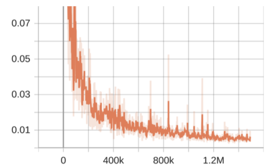
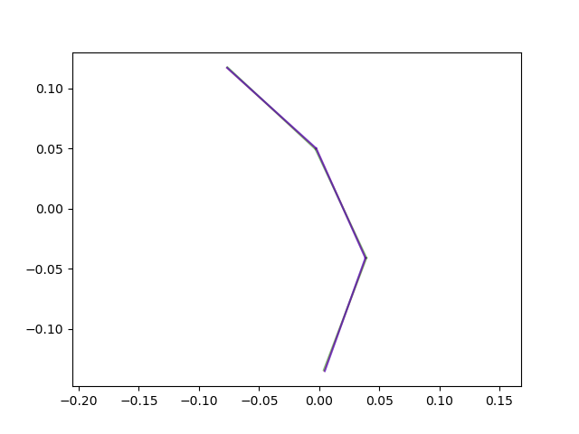
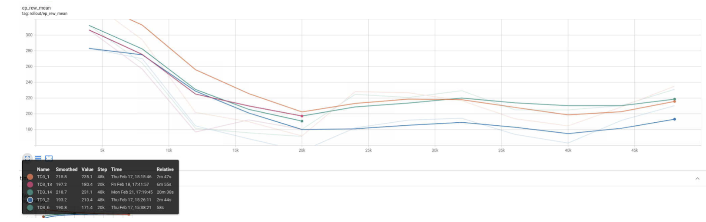
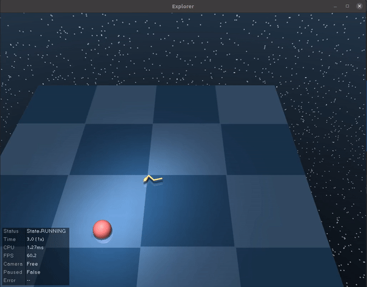

# Introduction 
Based on the original Repository at  https://github.com/fxia22/gn.pytorch/  

- The project learns the dynamics of the agent by using the Graph Neural Networks [Graph networks as learnable physics engines for inference and control](https://arxiv.org/abs/1806.01242).
- The learned GNN Model is integrated into the Deep Mind Control Suite to learn a policy for reaching the goal, please replace your original dm_control package with the files from dm_control_mod  

- The code for explanation is contained in the explanations folder the files contain instructions for generating the decision trees for policy. Please look into "explainPolicy.ipynb" and "explainDynamics.ipynb"

- Models and files are named _swimmer3 for all swimmer3 trained policies and gnn models and the data sets 

## Dependencies
 Please install the following Dependencies
- [DeepMind control suite](https://github.com/deepmind/dm_control)
- Mujoco
- networkx
- pytorch 0.4.1 (other versions untested)
- stable_baselines3

## Generate data

Generate data with `gen_data_new.py` script, for the 3-link swimmers states. A pregenerated data file is given here "swimmer3.npy" and "swimmer3_eval.npy" 

Normalise the data using "normalizer.py" a pre-generated file is given here "normalize3.pth" 

## Train GN

`python train_gn.py` to train the model. The learning rate schedule corresponds to "fast training" in original paper.

## Evaluate GN

`python evaluate_gn.py <model path>`

## Predicted and Actual dynamics of  swimmer3
- GNN loss for swimmer3 

- GNN predicted vs actual state 

# Swimmer3 learned policy 
TD3 has worked the best for us with an mean reward of 218

# Demo of swimmer3 moving 

# Explanations

The policy explanation is attempted by  building a decision tree of optimal policy and model policy. The details are given in 
"explainDynamics.ipynb" and "explainPolicy.ipynb"  

